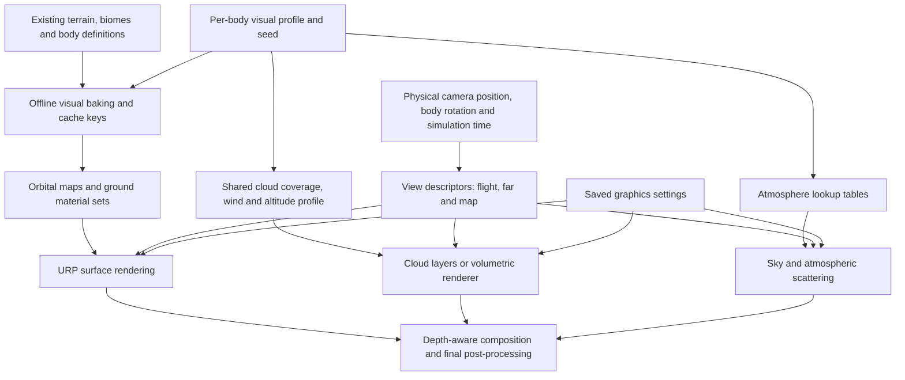

# Planet visual upgrade: proposed implementation plan

Date: 2026-09-30. Status: **Implemented; visual review and deferred hardware performance acceptance pending.**

Delivery and exact validation scope: [PLANET_VISUALS_IMPLEMENTATION.md](D:/Dev/KSP/Docs/PLANET_VISUALS_IMPLEMENTATION.md). Current assets are 4K orbital maps and 2K tiled sets on all presets (Low biases ground mips). Optional Ultra 8K/selected 4K authoring upgrades remain for hardware-informed tuning.

User steering: performance measurements are deferred until the user authorizes them because other work on the PC would bias results. Functional checks, compilation and visual inspection may proceed. Map bodies must also gain detailed surfaces and visible terrain relief, rather than remain smooth generic spheres.

Research: [PLANET_VISUALS_RESEARCH.md](D:/Dev/KSP/Docs/PLANET_VISUALS_RESEARCH.md).

## Proposed outcome

Tellus should read as a detailed natural world from orbit: distinct land and ocean surfaces, large-scale cloud formations with small breakup, shadows beneath clouds, realistic blue limb and sunset colour. Near the ground, biome materials should replace the uniform coloured/noise appearance. Luma should gain convincing regolith, basalt and crater detail with appropriate airless lighting.

Ultra must include true spherical volumetric clouds that can be seen from below, above and inside. Clouds must be independently switchable between Off, Layers and Volumetric. The attached image guides composition and lighting; acceptance requires actual TAP captures from multiple viewpoints, not a single staged image.

Target: 60 FPS on the user's RTX 3070 laptop at an initial 1920x1080 benchmark resolution. Native resolution and GPU power/VRAM are recorded in the baseline phase. This is a performance target to validate, not a promise based on GPU name alone.

## Scope and constraints

- Deliver art and rendering for the current playable Tellus/Luma system, with reusable data for future bodies and a fallback for custom/debug bodies.
- Preserve terrain height, biome identities, launch-site flattening, collision geometry, physics atmosphere, orbital mechanics and save compatibility. Visual wave normals and surface roughness do not change buoyancy or sea level.
- Keep Unity 6000.5.7f1 and URP 17.5.0. Use Render Graph for new renderer features.
- Work with the far base / flight overlay cameras and the separate map view. Keep post-processing once per completed view.
- Use original planet maps and visual seeds; selected CC0 tiled materials and verified compatible source may be incorporated with provenance. No paid dependency is proposed.
- Add focused graphics controls to the existing settings/pause flow; no general HUD redesign.
- Include lightweight visual rocks/boulders and ocean shading polish. Full vegetation ecosystems, a new ocean simulation, weather gameplay, lightning, city-light networks and new planets are later work.

The existing roadmap's ART-07a / ART-08a cover much of the surface/atmosphere work. D-16 currently defers simple clouds to EA5. Approval of this proposal advances cloud work and adds a volumetric option; update those roadmap entries when implementation begins, without marking future worlds complete.

## Rendering design

### Data and authoring

Introduce a per-body visual profile keyed by body ID. It names surface material sets, orbital assets, ocean appearance, atmospheric scattering parameters, cloud coverage seed/map, layer base/top altitude, density, wind and quality overrides. Existing biome material-set names provide the connection to terrain data.

Render adapters consume existing Core body/terrain data rather than adding Unity asset dependencies to the simulation model. Profiles are optional: an unknown body keeps a valid generated fallback, and an airless body does not acquire atmosphere or clouds by default.

Bake orbital colour, normals and masks from the current terrain definition. Cache keys include terrain fingerprint, visual profile version and bake settings. Authoring edits invalidate affected assets; ordinary flight does not run an expensive 8K bake. Keep an asynchronous lower-resolution fallback for bodies without baked assets. Update the asset builder so regeneration retains the intended visual profiles and import settings.

### Surface detail at three distances

1. **Orbit and far views:** detailed albedo/normal/roughness-ocean masks; no fixed hillshade baked into flight albedo. Use the same geographic sampling for near and scaled terrain. Map view uses matching geography with its diagnostic biome overlay remaining readable.
2. **Regional views:** macro colour variation and smoothly blended biome/slope weights, so fields and mountains have structure without a visibly repeating tile pattern.
3. **Landing/EVA:** triplanar albedo, normal and packed material maps for grass/soil, sand, rock and snow/ice on Tellus; regolith, dark basalt and ejecta on Luma. Blend mainly the two dominant materials per pixel to control sampling cost. Prefer shader relief to expensive displacement near colliders.

Preserve current terrain LOD; tune distant mesh density and screen-space error only where captures show a silhouette/normal problem. Separate visual tessellation choices from the collision grid. Verify body-fixed material coordinates across chunk boundaries, LOD changes, planet rotation and origin shifts.

### Atmosphere and lighting

Implement a compact LUT-based scattering system with Rayleigh/Mie scattering, extinction and tunable absorption. It should provide sky colour, horizon haze, orbital limb, atmospheric light attenuation and aerial perspective using one consistent body profile. Adapt a documented atmosphere method rather than copying Scatterer's plugin.

Replace the old sky/fog/shell contributions in the upgraded path so atmosphere is not added twice. Retain an inexpensive analytic option for Low. Respect the actual body-to-star direction and existing eclipse logic. Tune exposure, bloom and star visibility after the scattering is working; the reference's large flare is an artistic guide rather than a requirement to obscure the view.

### Clouds

Layers mode uses a planet-wide coverage texture, fine detail modulation and thin secondary wisps on spherical layers, with correct sun lighting, night-side dimming and a soft shadow approximation.

Volumetric mode raymarches the region between cloud-base and cloud-top spheres. A shared weather map determines coverage/type; 3D shape and erosion noise provide depth. Include forward scattering near the sun, self-shadowing, atmosphere tint and soft terrain shadows. Derive animation from simulation UT and the visual seed, with periodic offsets to avoid precision loss.

Begin Ultra at half resolution in each dimension with a capped 64-96 view samples, a small lighting sample budget, jitter, empty-space skipping and early termination. Use cloud-specific history, depth rejection and reconstruction. These are starting settings to measure and tune. High uses a reduced 32-64 sample cap; lower modes keep layered clouds.

Full volumetric rendering prioritizes the atmospheric body occupying the main view. Other resolved distant bodies use matching layers; subpixel bodies retain their existing point rendering. Map view uses layers across all presets for clarity and cost. Changing presets must retain comparable coverage rather than invent different weather.

### Cameras, depth and history

Every participating view has an explicit physical camera/body position, metres per render unit, projection, body rotation, star direction and simulation time. Calculate large translations in doubles and submit camera-relative values to shaders.

Give each cloud body one owning representation: local flight, scaled far or map. Switch ownership with existing handover state and loading readiness, preventing duplicate cloud opacity. The same geographic coverage and lighting must survive the switch.

Far and flight hardware depth cannot be compared directly: their scales and projection planes differ. Acquire/resolve each relevant camera's opaque depth and convert to its physical ray distance. Validate the overlay depth clear and use separate depth resources if needed. Apply clouds after the owning opaque geometry and before final tone mapping. Test transparent plumes/windows explicitly; adapt their attenuation/composition where necessary so transparent content cannot appear through dense foreground cloud.

Keep history separately for each camera role/body. Reset or rebase it on origin changes, body/camera changes, map toggles, teleports, quickload, changed resolution, large time steps and discontinuous cloud motion. Standard URP camera TAA is not the solution for the current stack; retain the working view antialiasing while reconstructing the cloud buffer independently. [Unity feature constraints](https://docs.unity.com/en-us/engine/6000.5/manual/render-pipelines/choose-a-render-pipeline/feature-comparison).

## Quality presets

The values below are initial budgets, subject to measured tuning. Global maps mean width x height; ground values mean tiled texture size. The cloud selector can override the preset independently.

| Feature | Low | Medium | High | Ultra |
|---|---|---|---|---|
| Global surface maps | 2048x1024 | 4096x2048 | 4096x2048 | Up to 8192x4096 |
| Ground material textures | 1K | 2K | 2K | Selected 4K sets where visible |
| Atmosphere | Analytic approximation | LUT scattering | LUT scattering | LUT scattering, finer integration |
| Default clouds | Layers | Detailed layers | Volumetric, reduced samples | Volumetric, more detail/lighting |
| Cloud shadows | Cheap approximation | Low-resolution | Filtered | Better filtered/detail |
| Ocean | Basic normals/specular | Wave normals and roughness | Better glint and shore blend | Same model, higher detail |
| Visual rocks | Sparse | Moderate | More nearby | More detail within a fixed budget |
| Map clouds | Layers | Layers | Layers | Layers |

Support cloud Off on every preset, and Layers on High/Ultra. Do not silently disable requested volumetrics when optimizing. If the target misses 60 FPS, report the measured bottleneck and tune resolution/sample budgets while keeping the selected mode visible in settings.

## Implementation phases and reviewable outputs

All phases below start only after approval. Keep an implementation checklist and evidence paths current in this document or an accompanying report.

| Phase | Work | Completion evidence |
|---|---|---|
| 1. Baseline and cloud integration proof | Capture current views; record hardware, CPU/GPU timings and memory; build a minimal Render Graph spherical volume at Tellus scale; validate depth, camera roles and own history | Fly below/through/above the test cloud; correct capsule occlusion; stable origin shift; preliminary cloud timings. Resolve integration problems before investing in final cloud art. |
| 2. Surface materials and orbital assets | Select and record materials; bake Tellus/Luma orbital colour/normals/masks; implement biome material blending; improve map resolution and caching; tune visible LOD defects | Ground, coast, mountain, pole, lunar crater and orbital before/after captures. Unchanged terrain fingerprints and collider behaviour. |
| 3. Atmosphere | LUT generation/rendering; unify sky, aerial perspective and limb; tune sunlight, eclipse and exposure integration | Midday, sunrise/sunset, high altitude, terminator and orbit views; no abrupt atmosphere transition or double haze. |
| 4. Production clouds | Shared coverage; polished layer fallback; finalize volumetric shape, light/shadows, inside-cloud extinction and stable history | Recognizable weather in both modes; warm cloud edges at sunset; cloud shadows; ground-to-orbit and reentry captures in Volumetric mode. |
| 5. Ocean, surface dressing and controls | Wave normals/glint/shore blend; instanced visual rocks; saved presets and independent cloud choice | Coast and lunar landing views; settings persist after restart; quality changes release/reuse resources correctly. |
| 6. Player validation and tuning | Profile actual player on the laptop; tune budgets; replay flight and lunar regressions; produce comparison gallery and benchmark report | Visible improvement across the required views, tested graphics modes, stable missions and documented frame/memory results. |

Likely existing integration points are `Terrain.shader`, `CubeSphere.cs`, `PlanetTerrain.cs`, `PlanetManager.cs`, `PlanetMaps.cs`, `ScaledSpace.cs`, `SkyController.cs`, `AtmosphereShell.cs`, `MapView.cs` and `AssetBuilder.cs`. Add dedicated visual profiles, baking code, renderer features and HLSL rather than putting all new logic into those controllers. Register features through Unity editor APIs while the editor is available.

## Performance acceptance

The complete frame budget for 60 FPS is 16.67 ms. CPU and GPU timings are recorded independently; do not add overlapping pipeline timings as if they were serial costs.

Initial incremental GPU targets at 1080p are 2-3 ms for clouds including reconstruction/shadows, at most about 1 ms for atmosphere, and about 1-2 ms for added surface/ocean/dressing work. Aim for a combined added cost of at most 5 ms; these allocations must fit the actual baseline and are not guarantees.

Aim for less than 1 GiB additional resident GPU resources and leave headroom for the rest of the game and transient uploads. Compress suitable colour/mask textures, use proper normal-map formats and mip chains, and unload unneeded body resources. Confirm residency for texture arrays explicitly; do not assume ordinary texture streaming controls every custom shader resource.

Benchmark the Windows player while plugged in, recording resolution, GPU/driver, GPU power mode and exact Ryzen CPU. After warm-up, measure at least 60 seconds per view: pad, ascent through clouds, low orbit, sunset limb, reentry, lunar surface and map. Repeat the heaviest view after sustained running to expose thermal effects. Include starter craft and a representative 150-part craft; state any CPU limitation separately from the cloud cost.

The desired acceptance is a 95th-percentile frame time at or below 16.67 ms in the agreed representative views, with no recurring streaming stalls. If an inherited baseline already misses this, record the cause and achievable visual settings instead of claiming a blanket 60 FPS result. A release build and actual GPU profiling are required; an editor view or headless mission cannot prove visual performance.

## Visual and regression checks

- [ ] Tellus ground materials show small detail, biome variation and coherent lighting without obvious tiling.
- [ ] Tellus from 80 km and 300 km shows detailed geography, clouds/shadows, limb and terminator colour.
- [ ] A camera travels continuously from the pad, through a cloud, into orbit and back through reentry; no shell disappearance, hollow volume, clipping or abrupt representation switch.
- [ ] Clouds respect the horizon, planet occlusion, terrain and rocket silhouettes; no fog leaking through foreground objects.
- [ ] Sunset cloud colour and sky extinction follow the sun, including from orbit and the night side.
- [ ] Cloud/terrain coverage stays attached through rotation, chunk/LOD transitions and floating-origin changes.
- [ ] Local/far handover near six body radii, including partially loaded terrain, produces no duplicate opacity or conspicuous material seam.
- [ ] Pause, rails warp, physics warp, quickload, teleport, SOI change and map switching do not smear history or restart the weather unexpectedly.
- [ ] Airless Luma remains airless and gains useful surface/crater detail.
- [ ] Custom/debug bodies load without requiring hand-authored visual assets; no missing-material rendering.
- [ ] Map terrain/biome tools, orbit lines and markers remain readable with cloud layers.
- [ ] Cloud Off/Layers/Volumetric and all presets work in the player and retain settings.
- [ ] Terrain fingerprint tests and relevant existing tests pass; replay the orbit, lunar and persistence player missions.
- [ ] Before/after gallery uses the same coordinates, UT, field of view and resolution. It includes motion clips for history/cloud transitions.
- [ ] CPU/GPU frame time and memory report identifies tested hardware and settings, with no unmeasured success claims.

Visual approval is a separate completion criterion from compilation and mission tests.

## Approval boundary

The user approved implementation on 2026-09-30. Performance benchmarking remains deferred by their instruction.

Approval authorizes the six phases above for Tellus and Luma, including true switchable volumetric clouds, surface/atmosphere/ocean improvements, quality controls and player verification. If the early integration proof exposes a major change to the proposed architecture or cost, present the concrete finding before expanding scope.
